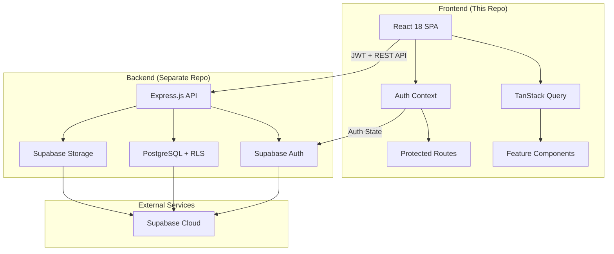

# Sabz – Pakistan's Complete Real-Estate Marketplace 🏡

[](https://react.dev)
[](https://supabase.com)
[](https://tanstack.com/query)
[](#-license)

**Sabz is a production-ready real estate marketplace** where homeowners can list their properties in minutes and buyers can discover beautiful homes across Pakistan. This repository contains the complete React frontend application that connects to a separate Express.js/Supabase backend API.

---

## 📑 Table of Contents
1. [Live Demo](#-live-demo)
2. [Feature Overview](#-feature-overview)
3. [Tech Stack](#-tech-stack)
4. [System Architecture](#-system-architecture)
5. [Source-Code Layout](#-source-code-layout)
6. [Key Features Deep Dive](#-key-features-deep-dive)
7. [Local Development](#-local-development)
8. [Environment Configuration](#-environment-configuration)
9. [NPM Scripts](#-npm-scripts)
10. [Testing](#-testing)
11. [Deployment](#-deployment)
12. [Contributing](#-contributing)
13. [License](#-license)

---

## 🚀 Live Demo

> **Coming soon** — we're moving to Vercel! Until then the project runs great locally with the backend API.

---

## ✨ Feature Overview

### 🔐 Complete Authentication System
- **User Registration & Login** with email/password via Supabase Auth
- **Session Management** with automatic token refresh and multi-tab sync
- **Protected Routes** with automatic redirects to login when needed
- **Persistent Sessions** that survive page refreshes and browser restarts

### 🏠 Property Listing Management
- **2-Step Creation Wizard** – intuitive multi-screen flow (property details → photos & publishing)
- **Comprehensive Edit System** – 8 modular edit cards for in-place editing
- **Photo Management** – drag-and-drop reordering with dnd-kit, multi-file upload
- **My Listings Dashboard** – manage all your property listings in one place
- **Real-time Status Tracking** – pending/approved/rejected status system

### 💝 User Experience Features
- **Bookmark System** – save favorite listings with optimistic UI updates
- **Saved Listings Page** – dedicated view for bookmarked properties
- **Share Functionality** – copy-to-clipboard sharing for any listing
- **Responsive Image Carousels** – smooth navigation through property photos
- **Mobile-First Design** – works seamlessly on all devices

### 🎯 Property Discovery
- **Curated Home Page** – grid of approved listings with rich property cards
- **Detailed Listing Pages** – full property information, photo galleries, features
- **Location Details** – comprehensive address and area information
- **Property Features** – bedrooms, bathrooms, square footage, amenities

---

## 🛠 Tech Stack

### Frontend Core
- **React 18** – Latest React with modern hooks and concurrent features
- **React Router DOM** – Client-side routing with protected route support
- **CSS Modules** – Scoped styling with zero conflicts

### State & Data Management
- **TanStack Query (React Query)** – Server state management with caching and optimistic updates
- **React Context** – App-wide state for authentication and listing drafts
- **React Hook Form** – Performant forms with validation

### UI & Interactions
- **@dnd-kit** – Drag-and-drop functionality for photo management
- **React Icons** – Comprehensive icon library
- **Embla Carousel** – Smooth, touch-friendly image carousels
- **React Confetti** – Celebration animations for successful actions

### Backend Integration
- **Supabase Client** – Authentication, database, and file storage
- **Fetch API** – RESTful API communication with JWT authentication
- **FormData** – Multipart file uploads for images

### Development & Quality
- **React Scripts (CRA)** – Zero-configuration build tooling
- **Testing Library** – Component testing with accessibility focus
- **ESLint & Prettier** – Code quality and consistent formatting

---

## 🏗 System Architecture



---

## 📂 Source-Code Layout

```
src/
├── api.js                     # API layer - all backend communication
├── supabaseClient.js          # Supabase client configuration
├── App.js                     # Root component with routing & layout
├── index.js                   # React DOM entry point
│
├── components/                # Reusable UI components
│   ├── common/                # Generic building blocks
│   │   ├── Button/            # ExitButton, NavButtons, ShareButton
│   │   ├── Counter/           # Increment/decrement input
│   │   ├── EditModal/         # Slide-up modal for editing
│   │   └── PhotoManager/      # Drag-n-drop photo management
│   ├── layout/                # App-wide layout components
│   │   ├── Navbar/            # Top navigation with auth state
│   │   ├── Footer/            # Site footer
│   │   └── BottomNav/         # Mobile tab navigation
│   ├── ListingCard/           # Home page listing cards with carousels
│   └── PrivateRoute.jsx       # Auth-protected route wrapper
│
├── context/                   # React Context providers
│   ├── AuthContext.jsx        # Authentication state & methods
│   └── ListingDraftProvider.js # Listing creation/edit state
│
├── features/                  # Complete user flows (domain-specific)
│   ├── listing-create/        # 2-step property listing wizard
│   │   ├── intro/             # Welcome & steps overview
│   │   ├── step1/             # Property details (4 screens)
│   │   └── step2/             # Photos, pricing, publishing (5 screens)
│   ├── listing-edit/          # Comprehensive listing editing
│   │   ├── EditListing.jsx    # Main edit page with card system
│   │   └── EditCards/         # 8 modular editing cards
│   │       ├── 01_PhotosCard/
│   │       ├── 02_PriceCard/
│   │       ├── 03_TitleCard/
│   │       ├── 04_PropertyTypeCard/
│   │       ├── 05_BasicInfoCard/
│   │       ├── 06_LocationCard/
│   │       ├── 07_AmenitiesCard/
│   │       └── 08_DescriptionCard/
│   └── my-listings/           # Property management dashboard
│
├── hooks/                     # Custom React hooks
│   ├── useApprovedListings.js # Home page data fetching
│   ├── useListing.js          # Single listing data
│   ├── useBookmarks.js        # Bookmark management with optimistic updates
│   └── useScrollVisibility.js # UI behavior hooks
│
├── models/                    # Data models & transformations
│   └── Listing.js             # Listing shape definitions & API format conversion
│
├── pages/                     # Top-level route components
│   ├── auth/                  # Authentication pages
│   │   ├── Login.jsx
│   │   ├── Signup.jsx
│   │   └── ForgotPassword.jsx
│   ├── home/                  # Home page with listing grid
│   ├── listing/               # Individual property pages
│   │   └── components/        # Listing page specific components
│   └── SavedListings.jsx      # Bookmarked properties page
│
├── styles/                    # Global styles & CSS variables
│   └── global.css             # App-wide styling & font imports
│
├── utils/                     # Pure utility functions
│   ├── listingUtils.js        # Price formatting, location utils
│   ├── smokeTest.js           # Development testing scenarios
│   └── testSecurity.js        # Security validation utilities
│
└── setupTests.js              # Jest & Testing Library configuration
```

### Why This Structure?

- **Feature-First Organization**: Complete user flows live in `features/`, making it easy to understand and maintain domain logic
- **Reusable Components**: Generic UI lives in `components/common/`, ensuring no domain coupling
- **Custom Hooks**: Data fetching and UI logic is collocated and reusable across components
- **CSS Modules**: Every component has its own scoped styles, preventing style conflicts
- **API Layer**: Centralized in `api.js` with consistent error handling and data transformation

---

## 🔥 Key Features Deep Dive

### 🎯 Listing Creation Wizard
**9-step guided experience** that makes property listing effortless:
1. **Intro** - Overview of the process
2. **Property Type** - House, apartment, commercial, etc.
3. **Basic Info** - Bedrooms, bathrooms, area
4. **Location** - Complete address with Pakistan-specific fields
5. **Amenities** - Modern amenities selection
6. **Photos** - Drag-and-drop photo management
7. **Title & Description** - Property marketing content
8. **Pricing** - Flexible pricing options
9. **Review & Publish** - Final preview before submission

### ✏️ Advanced Editing System
**8 modular edit cards** allow granular control over listing properties:
- **PhotosCard** - Add, remove, reorder photos with drag-and-drop
- **PriceCard** - Update pricing information
- **TitleCard** - Edit property title
- **DescriptionCard** - Modify property description
- **PropertyTypeCard** - Change property type
- **BasicInfoCard** - Update bedrooms, bathrooms, area
- **LocationCard** - Modify address and location details
- **AmenitiesCard** - Update available amenities

**Features:**
- Unsaved changes indicator
- Bulk save functionality
- Individual card editing
- Real-time photo upload to Supabase Storage

### 💝 Smart Bookmark System
- **Optimistic UI Updates** - Instant visual feedback
- **TanStack Query Integration** - Efficient caching and synchronization
- **Protected Functionality** - Automatic redirect to login for unauthenticated users
- **Persistent Storage** - Bookmarks synced across devices

### 🔐 Robust Authentication
- **Supabase Auth Integration** - Enterprise-grade authentication
- **JWT Token Management** - Automatic refresh and secure storage
- **Multi-tab Synchronization** - Auth state synced across browser tabs
- **Protected Route System** - Automatic redirects with return navigation

---

## 💻 Local Development

### Prerequisites
- **Node.js** 16+ (recommended: use latest LTS)
- **npm** 8+ or **yarn** 1.22+
- **Supabase account** with project set up
- **Backend API** running (separate repository)

### Setup Instructions

```bash
# 1. Clone the repository
git clone https://github.com/your-org/realestateproject.git
cd realestateproject

# 2. Install dependencies
npm install

# 3. Environment configuration
cp .env.example .env.local

# Edit .env.local with your configuration:
# REACT_APP_API_BASE=http://localhost:3001
# REACT_APP_SUPABASE_URL=your_supabase_url
# REACT_APP_SUPABASE_ANON_KEY=your_supabase_anon_key

# 4. Start development server
npm start
```

The app will open at **http://localhost:3000** with hot reloading enabled.

### Development Workflow
1. **Frontend** (this repo) runs on `localhost:3000`
2. **Backend API** should run on `localhost:3001` (or update `REACT_APP_API_BASE`)
3. **Supabase** handles authentication and file storage
4. Changes auto-reload with fast refresh

---

## 🌍 Environment Configuration

### Required Environment Variables

Create a `.env.local` file in the project root:

```bash
# Backend API Configuration
REACT_APP_API_BASE=http://localhost:3001

# Supabase Configuration
REACT_APP_SUPABASE_URL=https://your-project.supabase.co
REACT_APP_SUPABASE_ANON_KEY=your_public_anon_key
```

### Environment-Specific Settings

**Development:**
```bash
REACT_APP_API_BASE=http://localhost:3001
```

**Production:**
```bash
REACT_APP_API_BASE=https://your-backend-api.herokuapp.com
```

**Staging:**
```bash
REACT_APP_API_BASE=https://staging-api.your-domain.com
```

---

## 📜 NPM Scripts

| Script | Description |
|--------|-------------|
| `npm start` | Start development server with hot reloading |
| `npm run build` | Create production build in `build/` directory |
| `npm test` | Run Jest + React Testing Library tests |
| `npm run test:watch` | Run tests in watch mode |
| `npm run eject` | ⚠️ Irreversible CRA ejection |

---

## 🧪 Testing

### Testing Stack
- **Jest** - Test runner and assertion library
- **React Testing Library** - Component testing with user-centric approach
- **User Event** - Realistic user interaction simulation
- **MSW** (planned) - Mock Service Worker for API mocking

### Running Tests
```bash
# Run all tests
npm test

# Run tests in watch mode
npm run test:watch

# Run tests with coverage
npm test -- --coverage
```

### Test Structure
- **Unit Tests** - Located next to source files (`Component.test.jsx`)
- **Integration Tests** - Testing feature flows end-to-end
- **Accessibility Tests** - RTL's built-in a11y testing

### Manual Testing
The app includes comprehensive smoke test scenarios in `src/utils/smokeTest.js` for manual QA:
- Anonymous user flows
- Authentication workflows  
- Listing creation and editing
- Bookmark functionality
- Session persistence
- Security validation

---

## 🚢 Deployment

### Production Build
```bash
# Create optimized production build
npm run build

# Serve locally to test production build
npx serve -s build
```

### Deployment Platforms

**Vercel (Recommended):**
```bash
# Install Vercel CLI
npm i -g vercel

# Deploy
vercel --prod
```

**Netlify:**
```bash
# Build command: npm run build
# Publish directory: build
```

**Firebase Hosting:**
```bash
npm install -g firebase-tools
firebase login
firebase init hosting
firebase deploy
```

### Environment Variables
Ensure all production environment variables are set in your deployment platform:
- `REACT_APP_API_BASE`
- `REACT_APP_SUPABASE_URL`
- `REACT_APP_SUPABASE_ANON_KEY`

---

## 🔄 Data Flow & State Management

### API Communication
1. **`src/api.js`** - Centralized API layer with consistent error handling
2. **JWT Authentication** - All protected requests include `Authorization: Bearer <token>`
3. **Data Transformation** - Automatic conversion between frontend and backend formats
4. **Error Handling** - Standardized error responses with user-friendly messages

### State Architecture
1. **TanStack Query** - Server state with caching, background updates, optimistic updates
2. **React Context** - App-wide state (auth, listing drafts)
3. **Local State** - Component-specific UI state
4. **URL State** - Route-based state for navigation

### Key Data Flows
- **Authentication**: Supabase Auth → AuthContext → Protected Routes
- **Listings**: API → TanStack Query → Components → Cache
- **Bookmarks**: Optimistic Updates → API → Cache Invalidation
- **File Uploads**: FormData → Supabase Storage → Database URLs

---

## 🤝 Contributing

We welcome contributions! 🙌

### Development Process
1. **Fork** the repository
2. **Create feature branch**: `git checkout -b feature/amazing-feature`
3. **Follow coding standards**: Run `npm run lint` before committing
4. **Test thoroughly**: Ensure all tests pass with `npm test`
5. **Commit with conventional commits**: `feat: add property search functionality`
6. **Open Pull Request** with detailed description

### Code Style Guidelines
- **2-space indentation**
- **Semicolons** required
- **Single quotes** for strings
- **CSS Modules** for styling
- **Functional components** with hooks
- **TypeScript** (planned migration)

### Before Submitting
```bash
# Lint and format code
npm run lint

# Run all tests
npm test

# Verify production build
npm run build
```

---

## 📝 License

© 2025 Sabz. All rights reserved.


---

## 🗺️ Roadmap

### 🔄 In Progress
- **TypeScript Migration** - Gradual migration to TypeScript for better developer experience
- **Enhanced Search** - Advanced filtering by location, price, property type
- **Map Integration** - Interactive map view with Leaflet/Google Maps

### 🎯 Planned Features
- **Real-time Chat** - Direct messaging between buyers and sellers
- **Advanced Analytics** - Property view statistics and market insights
- **PWA Support** - Offline functionality and app-like experience
- **Mobile App** - React Native version for iOS and Android
- **Payment Integration** - Secure payment processing for premium listings

### 🔧 Technical Improvements
- **Performance Optimization** - Code splitting, lazy loading, bundle optimization
- **SEO Enhancement** - Server-side rendering with Next.js
- **Testing Coverage** - Comprehensive test suite with E2E testing
- **CI/CD Pipeline** - Automated testing and deployment

---

> **Built with ❤️ by the Sabz team** — bringing transparency and simplicity to Pakistan's property market.

*Last updated: July 2025*